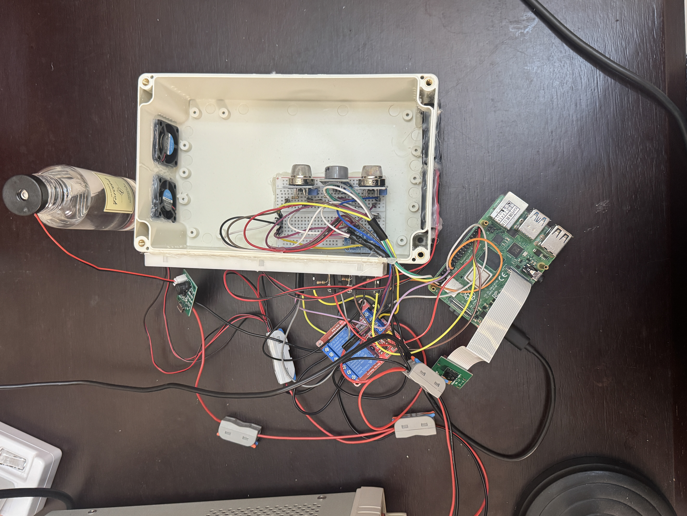

# 塔防:房東防禦大作戰之酒精與可燃氣體偵測智慧通風與除味系統

作者:113453006 陳坤輝

---

## (1) 專案簡介

本系統使用樹莓派搭配多組 MQ 氣體感測器（MQ-2、MQ-9、MQ-135）與 ADS1115 類比轉數位模組，即時量測環境中氣體濃度變化。系統透過多感測器資料融合與邊緣運算邏輯，將環境狀態分類為 Ambient、Alcohol-like 與 Gas-like，並依據狀態自動控制排風扇與除味霧化裝置，以降低異常氣體累積風險並改善室內空氣品質。

## (2) 影片與動作說明
https://www.youtube.com/watch?v=8FOCQ25Tr0I

1. 先送外接電源驅動繼電器
2. 打開程式碼
3. 當環境空氣正常時，側板LED顯示為綠燈。
4. 拿出酒精小瓶，在感測器前方進行兩次噴灑。
5. 當偵測到酒精時，LED燈轉"黃"，吹風與抽風扇啟動。
6. 當環境指數降回正常值，霧化器啟動，進行空氣芳香淨化30s。
7. 接著拿出打火機，模擬瓦斯外洩，在感測器前方進行數次噴灑。
8. 當偵測到瓦斯時，LED燈轉"紅"，吹風與抽風扇啟動。
9. 當環境指數降回正常值，霧化器啟動，再次進行空氣芳香淨化30s。
10. Demo 完成。

## (3) 裝置照片

## (4) 系統架構圖

## (5) 接線圖

## (6) 程式碼功能說明

本系統以 Python 撰寫，運行於 Raspberry Pi，核心功能為在邊緣端即時讀取多顆氣體感測器資料，進行狀態判斷，並自動控制通風與除味裝置。整體程式架構採用模組化設計，主要功能如下：

### 1. Sensor Data Acquisition
- 透過 I²C 介面讀取 ADS1115（16-bit ADC）數值
- 支援多通道類比輸入，分別對應 MQ-2、MQ-9、MQ-135 氣體感測器
- 將原始 ADC 數值轉換為實際電壓值，作為後續分析依據

### 2. Signal Pre-processing
- 對感測數據進行濾波處理（Median Filter + Exponential Moving Average）
- 降低瞬間雜訊與環境干擾對判斷結果的影響
- 提升整體系統穩定性與判斷一致性

### 3. Rule-based State Classification
- 採用規則式（Rule-based）邊緣判斷邏輯，非依賴雲端或 AI 模型
- 根據多感測器特徵組合，將環境狀態分類為：
  - **Ambient**：正常環境狀態
  - **Alcohol-like**：酒精 / VOC 類氣體特徵
  - **Gas-like**：可燃氣體相關特徵
- 透過多條門檻線與感測器交叉判斷，避免單一感測器誤判

### 4. Debounce & Hysteresis Mechanism
- 使用時間視窗（Debounce Window）累積多次判斷結果
- 僅在狀態穩定達到指定次數後才切換系統狀態
- 加入 Hysteresis 設計，避免狀態在臨界值附近頻繁切換

### 5. Event-driven Actuator Control
- 依最終判斷狀態自動控制 GPIO 輸出
- **排風扇（Fan）**
  - 在 Alcohol-like 或 Gas-like 狀態時立即啟動
  - 環境回復正常且低於指定門檻後才關閉
- **霧化裝置（Mist）**
  - 僅在氣體事件結束後才啟動
  - 支援延遲啟動與單次噴霧機制，避免過度除味

### 6. Status Indication
- 透過 LED 指示目前系統狀態：
  - 綠燈：Ambient
  - 黃燈：Alcohol-like
  - 紅燈：Gas-like
- 提供即時、直覺的視覺回饋

### 7. Data Logging
- 將每次感測數據、濾波後數值、狀態判斷結果與控制輸出
  以時間序列方式記錄至本地 CSV 檔案
- 方便後續參數調整、系統驗證與分析使用

### 8. Edge IoT Design Characteristics
- 系統所有判斷與控制皆於 Raspberry Pi 本地端即時完成
- 不依賴雲端服務即可獨立運作
- 網路僅作為未來擴充（如資料上傳或遠端監控）用途

  ---

## (7) 硬體零件需求與規格

## (8) 對應Pin與外接電源電流分配

## (9) 接腳對應

---

## (10) 軟體需求

1. 作業系統需求（Operating System）
- **Raspberry Pi OS**（基於 Debian 的 Linux 作業系統）
- 必須支援 **I²C** 與 **GPIO** 介面
- 建議版本：Raspberry Pi OS（Bullseye 或更新版本）

---

2. 程式語言與執行環境
- **Python 3.x**（建議版本 ≥ 3.7）
- 系統以單一主程式 `main.py` 執行
- 不需額外 Web Framework 或雲端服務即可運作

---

3. 必要 Python 套件（Libraries）

感測器與硬體控制
- `smbus` / `smbus2`  
  - 透過 I²C 與 ADS1115（16-bit ADC）進行通訊
- `RPi.GPIO`  
  - 控制 GPIO 腳位，用於 LED、風扇繼電器與霧化器繼電器

系統與資料處理
- `time`：取樣間隔、延遲與事件計時  
- `datetime`：產生時間戳記  
- `csv`：將感測與狀態資料記錄為 CSV 檔案  
- `os`：檔案與資料夾管理  
- `collections.deque`：實作滑動視窗，用於濾波與 debounce 判斷  

---

## (11) 目前限制

1. **感測器選擇限制**
   - 系統目前僅使用 MQ-2、MQ-9、MQ-135 三種氣體感測器
   - MQ 系列感測器屬於低成本半導體型，容易受環境溫溼度影響
   - 不同氣體之間仍可能存在交叉反應（cross-sensitivity）

2. **判斷邏輯為規則式（Rule-based）**
   - 目前氣體分類依賴人工設定門檻值與邏輯條件
   - 需透過實測資料反覆調整參數
   - 對於極端或未預期的氣體組合，分類能力有限

3. **缺乏高精度氣體濃度量測**
   - 系統以電壓變化趨勢作為判斷依據
   - 無法直接對應實際 ppm 或法規等級的氣體濃度數值

4. **資料儲存與分析能力有限**
   - 目前僅將資料記錄於本地 CSV 檔案
   - 缺乏長期趨勢分析與遠端監控能力

5. **使用者介面較為簡化**
   - 系統主要透過 LED 與終端機輸出顯示狀態
   - 尚未提供圖形化操作介面或行動裝置監控方式
  
---
## (12) 未來發展
1. **導入機器學習或 TinyML**
   - 蒐集長期標註資料後，可導入 TinyML 模型
   - 提升氣體分類準確率，降低人工門檻設定需求
   - 採用混合式架構（Rule-based + ML）

2. **擴充感測器種類**
   - 加入 PM2.5（如 PMS5003）或溫溼度感測器
   - 強化環境特徵分析與交叉驗證能力

3. **雲端與遠端監控整合**
   - 將資料上傳至 Firebase、AWS IoT 或 MQTT Broker
   - 建立 Web Dashboard 或手機 App 即時監控狀態

4. **智慧家居整合**
   - 與 Home Assistant 或其他智慧家居平台整合
   - 與空氣清淨機、空調系統聯動控制

5. **更精細的控制策略**
   - 依氣體強度調整風扇轉速（PWM 控制）
   - 動態調整霧化策略，提升除味效率並節省能耗

6. **系統可靠度與安全性強化**
   - 增加感測器異常偵測機制
   - 提供故障警示與系統自我診斷功能

